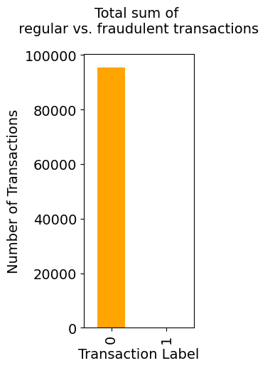
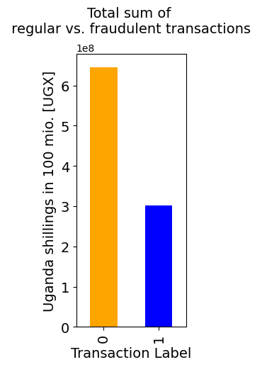

# The Challenge

The objective of this competition is to create a machine learning model to detect fraudulent transactions.

Fraud detection is an important application of machine learning in the financial services sector. This solution will help Xente provide improved and safer service to its customers.

Major Challenges of this binary classification task is the imbalanced dataset illustrated below.



Although the number of fraudulent transactions is low, the sum of the latter comprises 30 % of transaction volume. 




---
## Requirements and Environment

Requirements:
- pyenv with Python: 3.9.8

Environment: 

For installing the virtual environment you can either use the Makefile and run `make setup` or install it manually with the following commands: 

```Bash
pyenv local 3.9.8
python -m venv .venv
source .venv/bin/activate
pip install --upgrade pip
pip install -r requirements.txt
```

## Usage

In order to train the model and store test data in the data folder and the model in models run:

```bash
#activate env
source .venv/bin/activate

python example_files/train.py  
```

In order to test that predict works on a test set you created run:

```bash
python example_files/predict.py models/linear_regression_model.sav data/X_test.csv data/y_test.csv
```
```
python fraud-detection.py --help
usage: fraud-detection.py [-h] [--test-data-path TEST_DATA_PATH] [--model-path MODEL_PATH] [--csv-output-path CSV_OUTPUT_PATH]

Take fraud test data and generate predictions in a CSV file, and output the F1 and Matthew's Correlation Coefficient for the
results.

optional arguments:
  -h, --help            show this help message and exit
  --test-data-path TEST_DATA_PATH
                        The path to the labelled test data. Defaults to data/xente/full_test_export.csv
  --model-path MODEL_PATH
                        The path to a pickle file with the pre-trained model. Defaults to pickles/rf_model.p
  --csv-output-path CSV_OUTPUT_PATH
                        The absolute or relative path to output the CSV file with predictions, including the filename. Defaults
                        to output/predictions.csv
```

## Limitations

Development libraries are part of the production environment, normally these would be separate as the production code should be as slim as possible.


